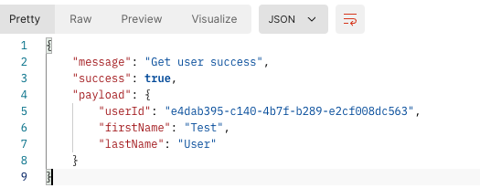

# Node.js (express.js) - gRPC realisation example
gRPC (gRPC Remote Procedure Calls) is a cross-platform high-performance remote procedure call (RPC) framework.
https://grpc.io/

## Getting started
## 1) Install Node.js (last stable version) https://nodejs.org/en/

---
## 2) Open new terminal and for client-server execute command: ```cd client-server```

---
## 3)To start locally:

- execute command: `npm install` (need to be executed once after project clone - to install packages);
- execute command: `npm run local`

---
## 5) For main-server repeat 2 and 3 steps, in step 2 use: ```cd main-server``` command

---

## 6).env

- PORT - indicates port on which will work server
- MONGO_DB_CONNECTION_STRING - mongodb database connection string

## 8) Prettier 
- execute command: ```npx prettier --write "**/*.js"```
- or 
- execute command: ```npx prettier --list-different "**/*.js"```

## 9) Test request
In postman execute get request http://localhost:8002/users/getUser/e4dab395-c140-4b7f-b289-e2cf008dc563

In response, you should see:
